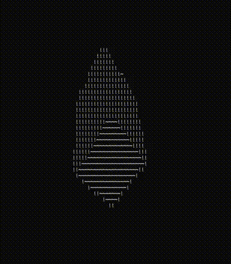

# Rotating shapes in 3D space with ASCII and Python

[Rotate shapes](https://roonscape.ai/p/a-song-of-shapes-and-words) in your command line with Python

- donut.py rotates a donut along x and z axes, from the famous [donut.c](https://www.a1k0n.net/2011/07/20/donut-math.html)

- cube.py rotates a cude along x, y and z axes

